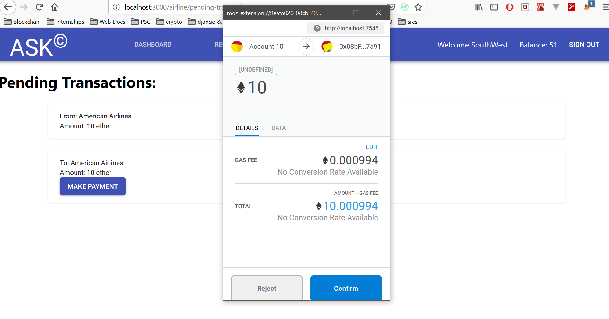

# Lab2: Airline Consortium ASK<sup>©</sup> for Ad-hoc, Impromptu and Emergency Seat Sales using Ethereum Blockchain

## Team:

- Saketh Varma Pericherla (sakethva@buffalo.edu)
- Prashanth Desu (pdesu@buffalo.edu)

## The Smart contract:

- The smart contract is present in the location "./truffle-build/contracts" named "ASK.sol"
  
- Following are the modifiers used:
  - onlyChairperson - only chairperson can call the method using this modifier
  - onlyAirline - only airline can call the method using this modifier
  - onlyChairpersonOrSelf - only chairperson or the user itself can call the method using this modifier
  - onlyNewAirline - only airline that has not registered can call the method using this modifier
  - onlyRegistered - only registered airline can call the method using this modifier
  - ensureNotSelf - ensures msg.sender is not the same as the airline passed as argument to the method using this modifier
  - onlyValidDeposit - deposit amount should be more than the defined minimum deposit

### Smart contract functions:

#### register():

- To deploy the contract, the chairperson needs to pass the minimum deposit requirement of atleast 50 ether as msg.value. The deposit is transferred to the smart contract address given by the below snippet:

```javascript
  contractAccount = address(this);
  contractAccount.transfer(msg.value);
```

- Access Modifiers - onlyNewAirline, onlyValidDeposit

#### unregister(address payable userAddress):

- When a user unregisters, the deposit amount will be deducted from contract balance and added to the user's account and the user details in the struct will be deleted. Below is a snippet from the unregister function:

```javascript
  require(chairperson != msg.sender, "Chairpersons cannot unregister themselves");        
  userAddress.transfer(airlines[userAddress].balance);
  delete airlines[userAddress];
```

- Access Modifiers: onlyChairpersonOrSelf(userAddress)


#### request(address toAirline, bytes32 requestHash):
- The request function is called to record the request hash on the blockchain. We use events in Solidity to record the request hash as shown in the below snippet from the request method:

```javascript
  event RequestSent(bytes32 requestHash);

  function request(address toAirline, bytes32 requestHash) public onlyAirline ensureNotSelf(toAirline) {
    emit RequestSent(requestHash);
  }
```
- Access modifier: onlyAirline ensureNotSelf(toAirline)

#### response(address payable toAirline, bytes32 requestHash, bool isDone):
- The response function is called to record the specified requestHash and request approval status specified by the boolean paramater isDone. Below code shows how it works:

```javascript
event ResponseSent(bytes32 requestHash, bool isDone);

function response(address payable toAirline, bytes32 requestHash, bool isDone) public onlyAirline ensureNotSelf(toAirline) {

  emit ResponseSent(requestHash, isDone);
}
```

#### settlePayment(address payable toAirline):

- Called by one airline to pay due in ether to other airline. Below snippet is used to transfer ether:  

```javascript
  toAirline.transfer(msg.value);
```

- Access modifier: onlyAirline ensureNotSelf(toAirline)


#### balanceOf(address userAddress):

- Returns balance in the specified user's account. Below snippet show how we retrieved user's balance from the struct in the airlines mapping.

  ```javascript
    airlines[userAddress].balance;
  ```
- Access modifiers: onlyRegistered(userAddress) onlyChairpersonOrSelf(userAddress)


## Steps to run the project:


- Download the latest binaries for Node.js and MongoDB.
- Create a database in MongoDB and call it `ask_db`.
- Add a database owner account using the following snippet:

```javascript
db.createUser({
  user: "ask_admin",
  pwd: "your password here",
  roles: [{ role: "dbOwner", db: "ask_db" }],
  passwordDigestor: "server"
});
```

- Install truffle using `npm install -g truffle` and install Ganache binary or CLI.
- Start the ganache process using CLI or open Ganache GUI, this will start the ganache private network process.
- Open a terminal and cd into the truffle-build directory and type `truffle compile` to compile the smart contract. Then type truffle migrate to deploy the smart contract on ganache.
- Create a .env file in the root of the project. Add the following variables in the .env file:
  
  ```javascript
  DB_URL="mongodb://<username>:<password>@localhost:27017/<db_name>"
  CONTRACT_ADDRESS="<contract address>"
  BC_HOST_URL="http://localhost:7545"
  ```

- Go to the terminal cd into the project root and type `npm install`.

- Once all the dependencies are installed type `npm run dev-test-run`
- Open the browser and type [http://localhost:8000](http://localhost:8000)


# Screens:

## <u>Signup Page:</u>

### Passenger Signup:


### Airline Signup:


## <u>Login Page:</u>


## <u>User Landing Page:</u>

### Airline Landing Page:


### Passenger Landing Page:


## <u>Passenger Purchases Page:</u>


## <u>Airline pending requests page:</u>

### Airline sending request to other airline:


### Airline sending response to passenger:


## <u>Transactions page:</u>

### Transactions page for airline that owes money:
